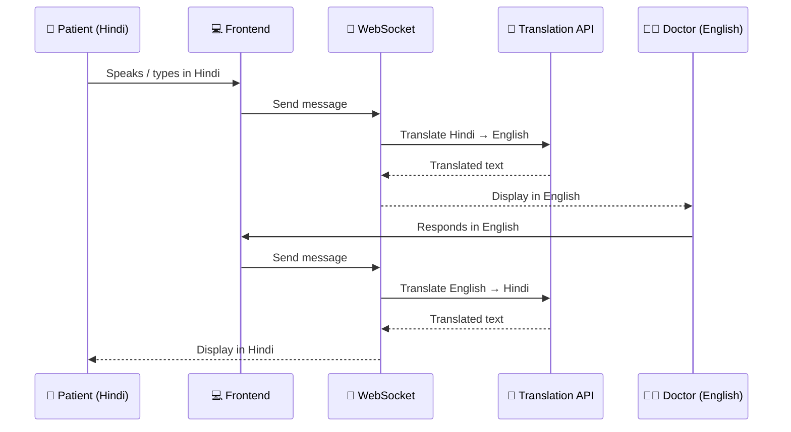
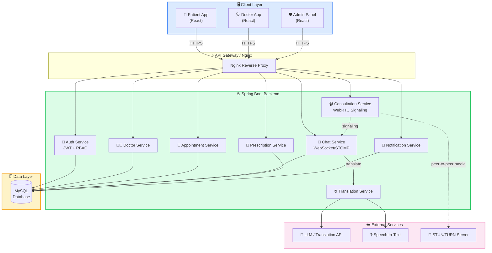
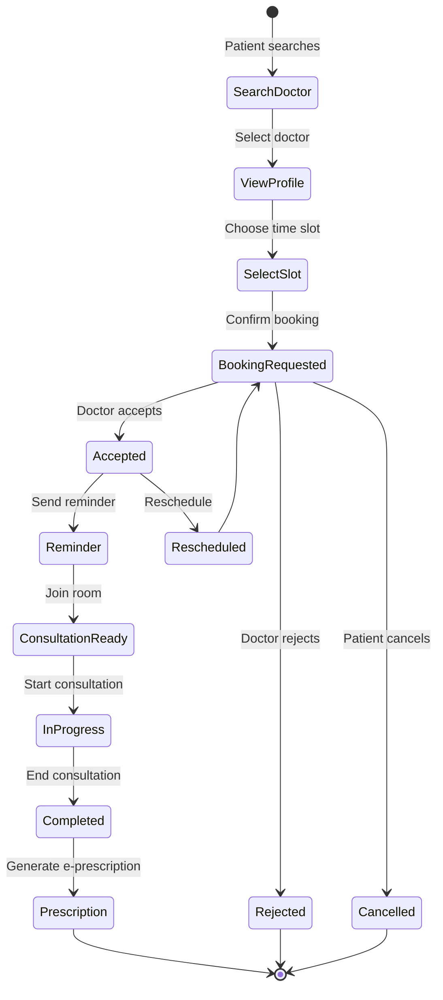
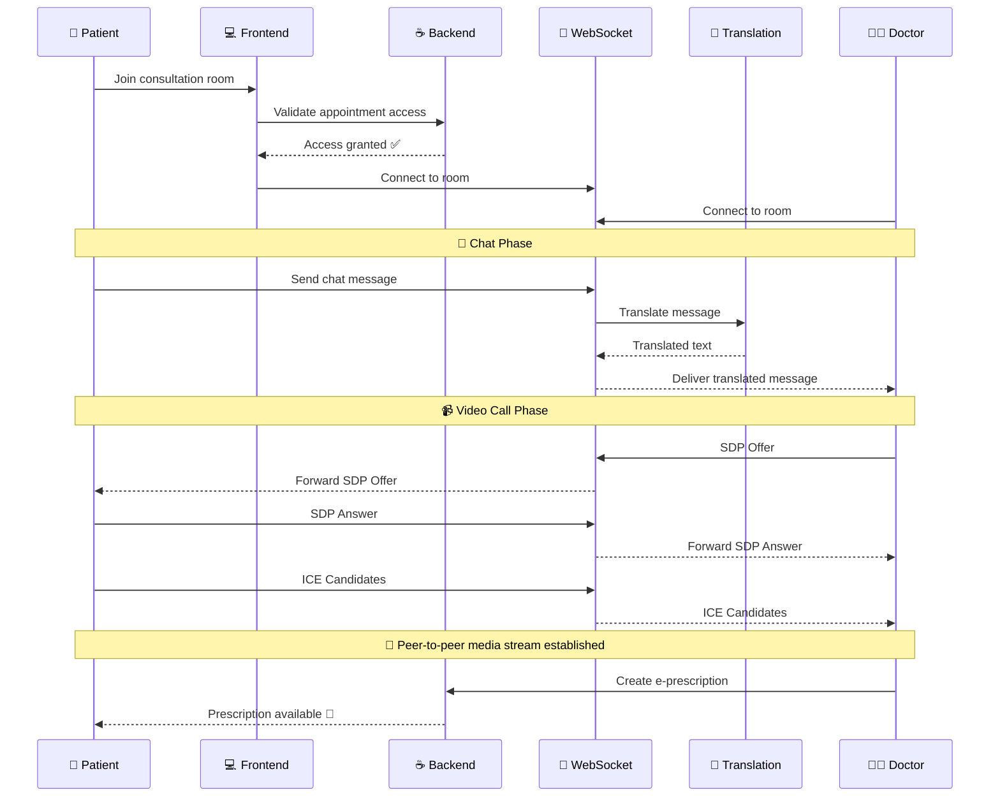
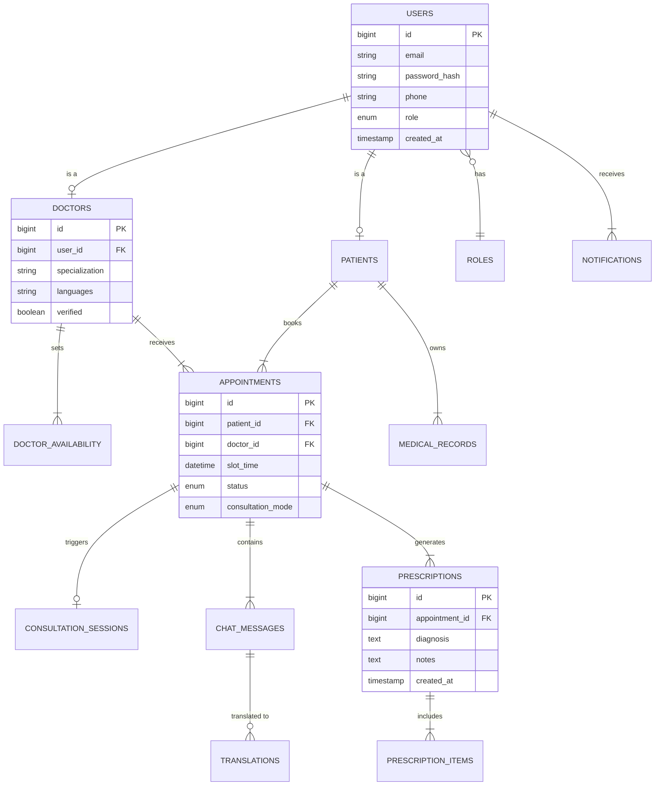
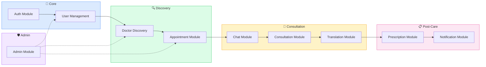
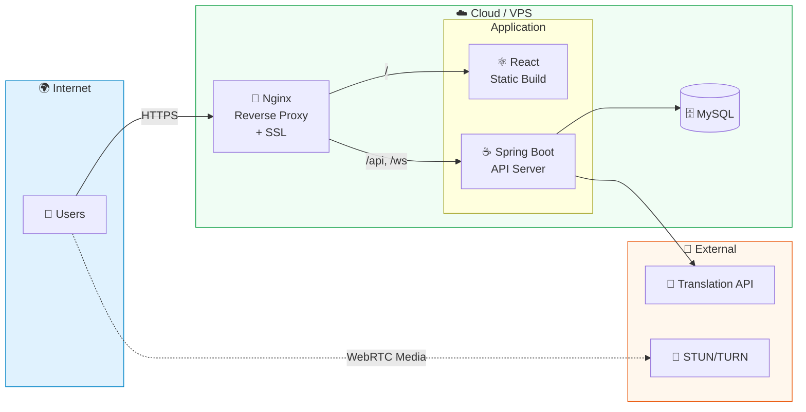
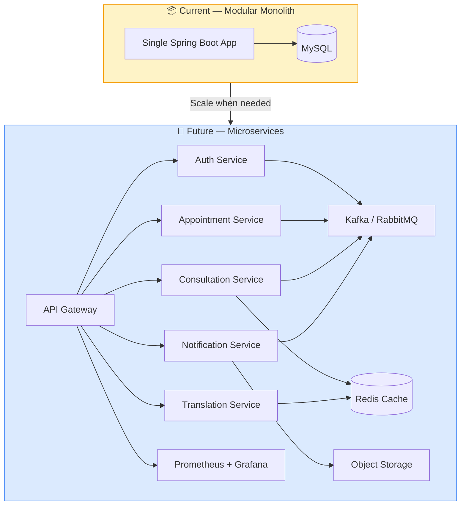

<p align="center">
  
</p>

<h1 align="center">🏥 SwasthyaSetu</h1>

<p align="center">
  <strong>AI-Powered Telehealth & Doctor Consultation Platform</strong>
</p>

<p align="center">
  <em>Bridging healthcare gaps with real-time consultations, AI-powered live translation, and digital prescriptions.</em>
</p>

<p align="center">
  
  
  
  
  
  
</p>

<p align="center">
  <a href="#-features">Features</a> •
  <a href="#-live-translation-engine">Translation Engine</a> •
  <a href="#%EF%B8%8F-system-architecture">Architecture</a> •
  <a href="#-getting-started">Getting Started</a> •
  <a href="#-roadmap">Roadmap</a>
</p>

---

## 📖 Overview

**SwasthyaSetu** (स्वास्थ्यसेतु — *"Bridge to Health"*) is a full-stack telehealth platform built to improve healthcare accessibility for rural and underserved communities. It enables patients to discover doctors, book appointments, join real-time chat or audio/video consultations, receive digital prescriptions, and communicate across language barriers through **live AI-powered translation**.

> Built with Java Spring Boot, React, MySQL, WebSocket, WebRTC, and LLM-based translation — designed to simulate a production-grade healthcare product.

---

## 🎯 Problem Statement

### For Patients
Patients in rural and semi-urban areas face critical barriers: limited access to specialists, long travel distances, language mismatches with doctors, inefficient scheduling, and poor continuity of prescriptions and consultation history.

### For Doctors
Doctors deal with manual slot management, fragmented patient context, inefficient follow-up workflows, and weak digital consultation tooling.

### The Solution
SwasthyaSetu provides a secure, real-time telemedicine platform with end-to-end appointment management, consultation support, prescription workflows, and multilingual communication — all in one place.

---

## ✨ Features

### 👤 Patient Portal
- 🔐 Secure registration & JWT-based login
- 🔍 Search doctors by specialization, language & availability
- 📅 Book, reschedule & cancel appointments
- 💬 Real-time chat with AI-translated messages
- 📹 Audio/video consultations via WebRTC
- 💊 Access e-prescriptions & consultation summaries
- 📋 Track appointment history & medical records
- 🔔 Appointment reminders & notifications

### 🩺 Doctor Dashboard
- 📝 Onboarding & profile management
- 🕐 Configurable availability slots
- ✅ Accept / reject appointment requests
- 👨‍⚕️ Join consultation rooms with full patient context
- 📄 Create digital prescriptions with treatment notes
- 📂 Maintain consultation records for continuity of care

### 🛡️ Admin Console
- ✔️ Verify doctor registrations
- 👥 Manage patient & doctor accounts
- 📊 Platform analytics & usage monitoring
- 🚩 Moderate flagged issues & misuse

---

## 🌐 Live Translation Engine

One of SwasthyaSetu's strongest differentiators — an **AI-powered translation layer** that breaks language barriers during consultations.

### How It Works



### Capabilities
- ⚡ Real-time chat message translation
- 🎙️ Speech-to-text during live consultations
- 📝 Transcript translation into user's preferred language
- 🗂️ Translated communication history preserved for future reference

---

## 🛠️ Tech Stack

| Layer | Technology |
|:------|:-----------|
| **Frontend** | React 18, Tailwind CSS, React Router, Axios, Zustand / Context API |
| **Backend** | Java 17, Spring Boot 3, Spring Security, Spring Data JPA, Hibernate, Maven |
| **Database** | MySQL 8 |
| **Real-time** | WebSocket / STOMP (chat & signaling), WebRTC (audio/video) |
| **Auth** | JWT, BCrypt, Role-Based Access Control (RBAC) |
| **AI Layer** | LLM / Translation API, Speech-to-Text, optional Text-to-Speech |
| **DevOps** | Docker, Nginx, Railway / Render / AWS / VPS |

---

## ⚙️ System Architecture



---

## 📅 Appointment Booking Flow



---

## 📹 Consultation Flow



---

## 🗄️ Database Design



---

## 📦 Module Breakdown



| # | Module | Responsibilities |
|:--|:-------|:-----------------|
| 1 | **Auth** | Signup / login, JWT creation & validation, role-based authorization |
| 2 | **User Management** | Patient & doctor profiles, admin verification, account lifecycle |
| 3 | **Doctor Discovery** | Search, specialization & language filters, availability lookup |
| 4 | **Appointment** | Slot creation, booking, cancellation, rescheduling, status transitions |
| 5 | **Chat** | Real-time messaging via WebSocket, message persistence, translation storage |
| 6 | **Consultation** | WebRTC signaling, call join/leave, session lifecycle management |
| 7 | **Translation** | Chat & transcript translation, language mapping, history persistence |
| 8 | **Prescription** | E-prescription creation, medicine instructions, consultation summary linkage |
| 9 | **Notification** | Confirmations, reminders, cancellation alerts, consultation notifications |
| 10 | **Admin** | Doctor approval, user oversight, analytics, moderation |

---

## 🔌 API Reference

<details>
<summary><strong>Auth</strong> — <code>/api/v1/auth</code></summary>

| Method | Endpoint | Description |
|:-------|:---------|:------------|
| `POST` | `/register` | Register new user |
| `POST` | `/login` | Authenticate & get JWT |
| `POST` | `/refresh` | Refresh access token |
| `GET` | `/me` | Get current user profile |

</details>

<details>
<summary><strong>Doctors</strong> — <code>/api/v1/doctors</code></summary>

| Method | Endpoint | Description |
|:-------|:---------|:------------|
| `GET` | `/` | List / search doctors |
| `GET` | `/{id}` | Get doctor profile |
| `PUT` | `/profile` | Update own profile |
| `POST` | `/availability` | Set availability slots |
| `GET` | `/availability/{doctorId}` | Get doctor availability |

</details>

<details>
<summary><strong>Appointments</strong> — <code>/api/v1/appointments</code></summary>

| Method | Endpoint | Description |
|:-------|:---------|:------------|
| `POST` | `/` | Create appointment |
| `GET` | `/my` | List my appointments |
| `PUT` | `/{id}/reschedule` | Reschedule appointment |
| `PUT` | `/{id}/cancel` | Cancel appointment |
| `PUT` | `/{id}/accept` | Doctor accepts |
| `PUT` | `/{id}/reject` | Doctor rejects |

</details>

<details>
<summary><strong>Chat</strong> — <code>/api/v1/chats</code></summary>

| Method | Endpoint | Description |
|:-------|:---------|:------------|
| `GET` | `/{appointmentId}/messages` | Get chat history |

</details>

<details>
<summary><strong>Prescriptions</strong> — <code>/api/v1/prescriptions</code></summary>

| Method | Endpoint | Description |
|:-------|:---------|:------------|
| `POST` | `/` | Create prescription |
| `GET` | `/{appointmentId}` | Get by appointment |
| `GET` | `/patient/{patientId}` | Get patient history |

</details>

<details>
<summary><strong>Admin</strong> — <code>/api/v1/admin</code></summary>

| Method | Endpoint | Description |
|:-------|:---------|:------------|
| `GET` | `/doctors/pending` | List pending verifications |
| `PUT` | `/doctors/{id}/verify` | Verify a doctor |
| `GET` | `/analytics/overview` | Platform analytics |
| `GET` | `/users` | List all users |

</details>

---

## 📡 Real-time Events

<details>
<summary><strong>WebSocket Event Reference</strong></summary>

**💬 Chat Events**
| Event | Description |
|:------|:------------|
| `SEND_MESSAGE` | Client sends a chat message |
| `RECEIVE_MESSAGE` | Server broadcasts message to room |
| `MESSAGE_TRANSLATED` | Translated version delivered |
| `USER_TYPING` | Typing indicator on |
| `USER_STOPPED_TYPING` | Typing indicator off |

**📹 Consultation Events**
| Event | Description |
|:------|:------------|
| `CALL_INITIATED` | Doctor/patient starts call |
| `CALL_ACCEPTED` | Callee accepts |
| `CALL_REJECTED` | Callee rejects |
| `CALL_ENDED` | Call terminated |
| `SDP_OFFER` | WebRTC SDP offer |
| `SDP_ANSWER` | WebRTC SDP answer |
| `ICE_CANDIDATE` | ICE candidate exchange |

**📅 Notification Events**
| Event | Description |
|:------|:------------|
| `APPOINTMENT_BOOKED` | New appointment created |
| `APPOINTMENT_UPDATED` | Appointment modified |
| `APPOINTMENT_CANCELLED` | Appointment cancelled |
| `CONSULTATION_REMINDER` | Upcoming consultation alert |

</details>

---

## 📁 Project Structure

```
swasthyasetu/
├── backend/
│   ├── src/main/java/com/swasthyasetu/
│   │   ├── config/           # App & WebSocket configuration
│   │   ├── controller/       # REST controllers
│   │   ├── dto/              # Request/Response DTOs
│   │   ├── entity/           # JPA entities
│   │   ├── enums/            # Status & role enums
│   │   ├── exception/        # Global exception handling
│   │   ├── mapper/           # Entity ↔ DTO mappers
│   │   ├── repository/       # Spring Data repositories
│   │   ├── security/         # JWT filters & security config
│   │   ├── service/          # Business logic layer
│   │   ├── websocket/        # WebSocket handlers & config
│   │   └── SwasthyaSetuApplication.java
│   ├── src/main/resources/
│   │   ├── application.yml
│   │   └── db/               # Migration scripts
│   └── pom.xml
├── frontend/
│   ├── src/
│   │   ├── api/              # Axios API clients
│   │   ├── assets/           # Static assets
│   │   ├── components/       # Reusable UI components
│   │   ├── features/         # Feature-specific modules
│   │   ├── hooks/            # Custom React hooks
│   │   ├── layouts/          # Page layouts
│   │   ├── pages/            # Route pages
│   │   ├── routes/           # Route definitions & guards
│   │   ├── store/            # Zustand / Context state
│   │   ├── utils/            # Helpers & utilities
│   │   └── main.jsx
│   ├── public/
│   ├── package.json
│   └── vite.config.js
├── docs/
│   ├── diagrams/
│   └── screenshots/
└── README.md
```

---

## 🚀 Getting Started

### Prerequisites

| Tool | Version |
|:-----|:--------|
| Java | 17+ |
| Maven | 3.8+ |
| Node.js | 18+ |
| MySQL | 8.0+ |
| Git | Latest |

### 1️⃣ Clone the Repository

```bash
git clone https://github.com/your-username/swasthyasetu.git
cd swasthyasetu
```

### 2️⃣ Backend Setup

```bash
cd backend
mvn clean install
mvn spring-boot:run
```

### 3️⃣ Frontend Setup

```bash
cd frontend
npm install
npm run dev
```

### 4️⃣ Environment Variables

Create `.env` files with the following:

**Backend** (`backend/application.yml` or env vars)
```env
DB_URL=jdbc:mysql://localhost:3306/swasthyasetu
DB_USERNAME=root
DB_PASSWORD=your_password
JWT_SECRET=your_secret_key
JWT_EXPIRY=86400000
TRANSLATION_API_KEY=your_translation_api_key
```

**Frontend** (`frontend/.env`)
```env
VITE_API_BASE_URL=http://localhost:8080/api/v1
VITE_WS_URL=http://localhost:8080/ws
VITE_STUN_SERVER=stun:stun.l.google.com:19302
```

---

## 🚢 Deployment Architecture



---

## 🔒 Security

| Layer | Implementation |
|:------|:---------------|
| **Authentication** | JWT-secured APIs with token refresh |
| **Password** | BCrypt hashing |
| **Authorization** | Role-based (Patient / Doctor / Admin) |
| **Consultation** | Access restricted to valid participants only |
| **Input** | Request payload validation & chat sanitization |
| **Prescriptions** | Ownership verification checks |
| **Transport** | HTTPS-ready deployment structure |
| **Audit** | Access control flow designed for audit trails |

---

## 📈 Scalability

### Current: Modular Monolith
The application is designed as a **modular monolith** — clean module boundaries that can be split into microservices when scale demands it.

### Future Scaling Path



---

## 🧪 Testing Strategy

| Layer | Tests |
|:------|:------|
| **Backend** | Service unit tests, controller integration tests, repository tests, auth/authz tests |
| **Frontend** | Component tests, form validation, route guards, state management |
| **Real-time** | Chat delivery, consultation room access, WebRTC signaling flow |
| **E2E** | Patient booking → doctor acceptance → consultation → e-prescription → translation flow |

---

## 🗺️ Roadmap

- [x] User authentication & role management
- [x] Doctor onboarding & availability management
- [x] Appointment booking lifecycle
- [x] Real-time chat via WebSocket
- [x] WebRTC-based audio/video consultations
- [x] E-prescription generation
- [x] Admin verification flow
- [x] AI-powered live translation
- [ ] Medical report uploads
- [ ] Payment gateway integration
- [ ] Family profile support
- [ ] Emergency priority booking
- [ ] AI symptom pre-screening
- [ ] Regional voice assistant
- [ ] Analytics dashboard with deeper healthcare insights

---

## 💼 Resume-Ready Description

> Built **SwasthyaSetu**, an AI-powered telehealth platform enabling doctor discovery, appointment booking, real-time chat, WebRTC-based audio/video consultation, multilingual live translation, and e-prescriptions — using **Java 17, Spring Boot, React, Tailwind CSS, WebSocket, WebRTC, JWT, and MySQL**.

---

## 👤 Author

**Shivam Goyal**

[](https://github.com/your-username)
[](https://linkedin.com/in/your-profile)

---

<p align="center">
  <strong>⭐ If you found this project useful, consider giving it a star!</strong>
</p>
