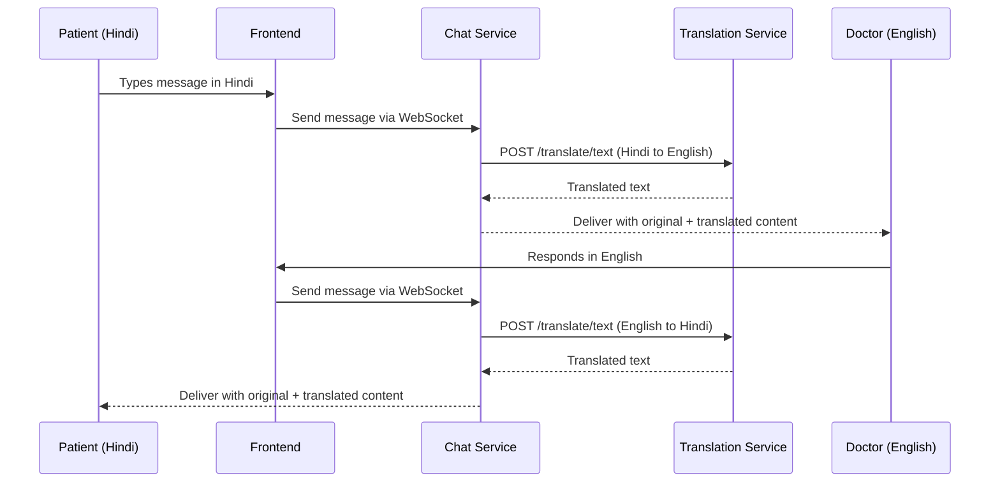
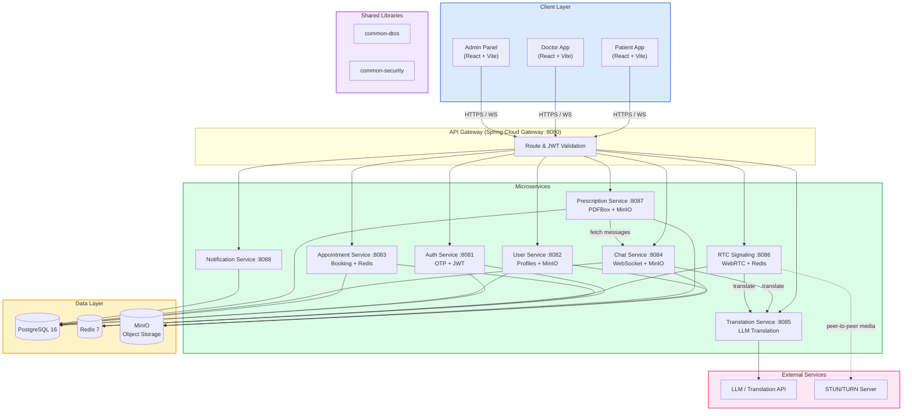
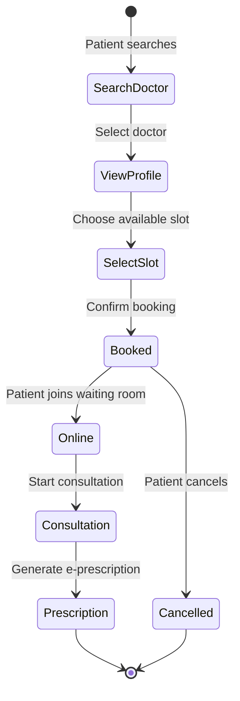
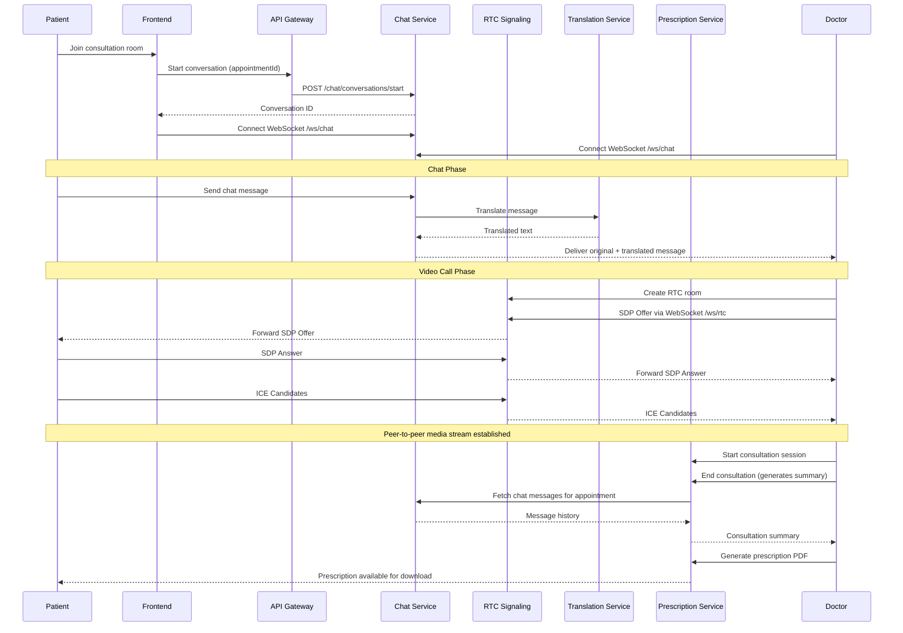
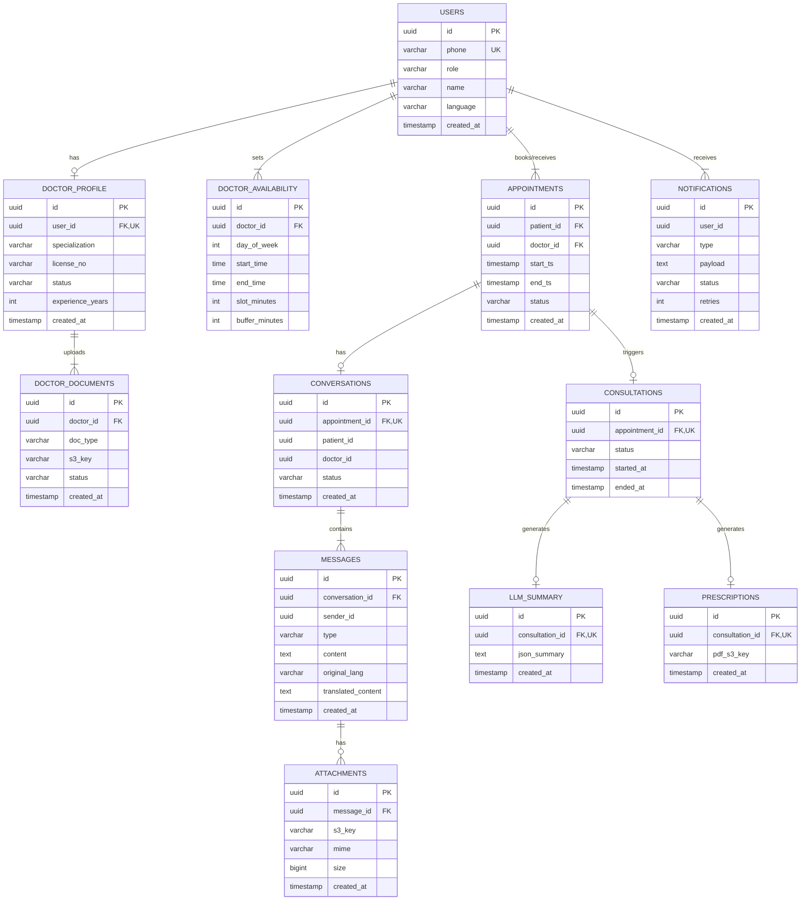
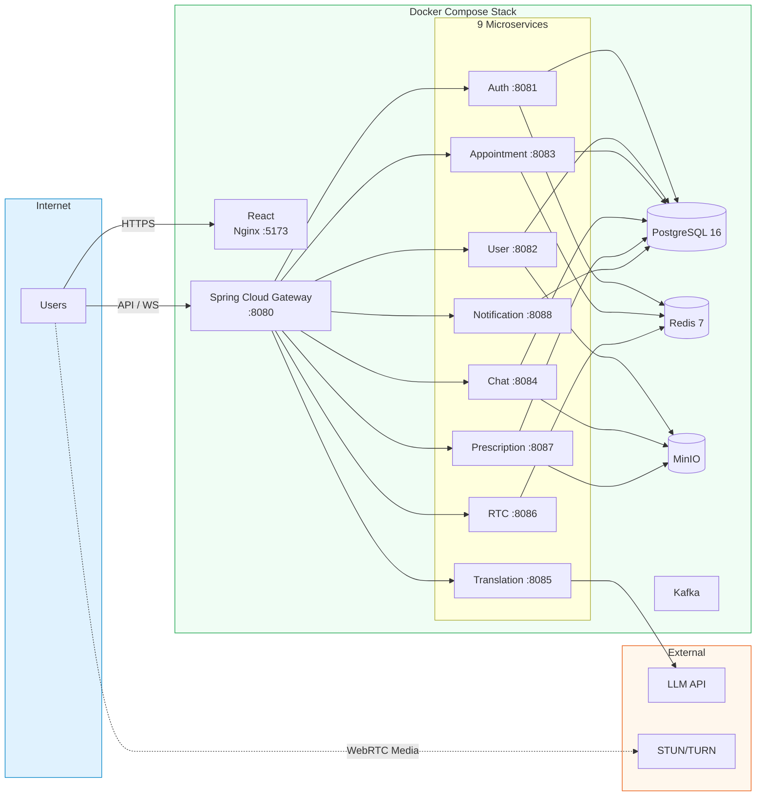

<h1 align="center">SwasthyaSetu</h1>

<p align="center">
  <strong>AI-Powered Telehealth & Doctor Consultation Platform</strong>
</p>

<p align="center">
  <em>Bridging healthcare gaps with real-time consultations, AI-powered live translation, and digital prescriptions.</em>
</p>

<p align="center">
  
  
  
  
  
  
  
</p>

<p align="center">
  <a href="#features">Features</a> &bull;
  <a href="#live-translation-engine">Translation Engine</a> &bull;
  <a href="#system-architecture">Architecture</a> &bull;
  <a href="#getting-started">Getting Started</a> &bull;
  <a href="#roadmap">Roadmap</a>
</p>

---

## Overview

**SwasthyaSetu** (&#2360;&#2381;&#2357;&#2366;&#2360;&#2381;&#2341;&#2381;&#2351;&#2360;&#2375;&#2340;&#2369; &mdash; *"Bridge to Health"*) is a full-stack telehealth platform built to improve healthcare accessibility for rural and underserved communities. It enables patients to discover doctors, book appointments, join real-time chat or audio/video consultations, receive digital prescriptions, and communicate across language barriers through **live AI-powered translation**.

> Built as a distributed microservices system with Java 21, Spring Boot, Spring Cloud Gateway, React, PostgreSQL, Redis, MinIO, WebSocket, and WebRTC &mdash; designed to simulate a production-grade healthcare product.

---

## Problem Statement

### For Patients
Patients in rural and semi-urban areas face critical barriers: limited access to specialists, long travel distances, language mismatches with doctors, inefficient scheduling, and poor continuity of prescriptions and consultation history.

### For Doctors
Doctors deal with manual slot management, fragmented patient context, inefficient follow-up workflows, and weak digital consultation tooling.

### The Solution
SwasthyaSetu provides a secure, real-time telemedicine platform with end-to-end appointment management, consultation support, prescription workflows, and multilingual communication &mdash; all in one place.

---

## Features

### Patient Portal
- Secure OTP-based phone authentication with JWT
- Search doctors by specialization, language & availability
- Book, reschedule & cancel appointments
- Real-time chat with AI-translated messages
- Audio/video consultations via WebRTC
- Access e-prescriptions & consultation summaries
- Track appointment history
- Appointment reminders & notifications

### Doctor Dashboard
- Onboarding & profile management with document upload
- Configurable weekly availability slots
- Patient queue management for the day
- Join consultation rooms with full patient context
- Create digital prescriptions with AI-generated summaries
- PDF prescription generation & download

### Admin Console
- Verify or reject doctor registrations
- View pending doctor applications
- Manage patient & doctor accounts

---

## Live Translation Engine

One of SwasthyaSetu's strongest differentiators &mdash; an **AI-powered translation layer** that breaks language barriers during consultations.

### How It Works



### Capabilities
- Real-time chat message translation via LLM
- Both original and translated messages preserved
- Language preference per user
- Translated communication history for future reference

---

## Tech Stack

| Layer | Technology |
|:------|:-----------|
| **Frontend** | React 18, Vite 5, Tailwind CSS, React Router 6, Axios |
| **API Gateway** | Spring Cloud Gateway 2023.0.3 |
| **Backend** | Java 21, Spring Boot 3.2.5, Spring Data JPA, Hibernate, Maven |
| **Database** | PostgreSQL 16 with Flyway migrations |
| **Caching** | Redis 7 (auth tokens, appointment slots, RTC sessions) |
| **Object Storage** | MinIO (doctor documents, chat attachments, prescription PDFs) |
| **Real-time** | WebSocket (chat & signaling), WebRTC (audio/video) |
| **Auth** | OTP-based phone authentication, JWT (access + refresh tokens), RBAC |
| **AI Layer** | LLM-based Translation API |
| **PDF Generation** | Apache PDFBox 3.0.2 |
| **Message Broker** | Apache Kafka (provisioned) |
| **DevOps** | Docker, Docker Compose, Nginx, multi-stage builds |

---

## System Architecture



---

## Appointment Booking Flow



---

## Consultation Flow



---

## Database Design



---

## Service Breakdown

| # | Service | Port | Responsibilities |
|:--|:--------|:-----|:-----------------|
| 1 | **API Gateway** | 8080 | Request routing, path rewriting, JWT validation, WebSocket proxy |
| 2 | **Auth Service** | 8081 | OTP request/verify, JWT generation, token refresh, Redis token cache |
| 3 | **User Service** | 8082 | Patient & doctor profiles, doctor onboarding, document uploads (MinIO), admin verification |
| 4 | **Appointment Service** | 8083 | Availability management, slot booking, cancellation, waiting room, doctor queue |
| 5 | **Chat Service** | 8084 | Real-time messaging via WebSocket/STOMP, message persistence, translation integration, attachments (MinIO) |
| 6 | **Translation Service** | 8085 | LLM-based text translation, language detection |
| 7 | **RTC Signaling Service** | 8086 | WebRTC SDP offer/answer relay, ICE candidate exchange, Redis session management |
| 8 | **Prescription Service** | 8087 | Consultation sessions, summary generation from chat history, PDF prescription generation (PDFBox), MinIO storage |
| 9 | **Notification Service** | 8088 | Appointment notifications, reminders, status updates |

### Shared Libraries

| Library | Purpose |
|:--------|:--------|
| **common-dtos** | Shared DTOs: `ApiResponse`, `ApiError`, `PageResponse` |
| **common-security** | JWT utilities (`JwtUtil`, `JwtAuthenticationFilter`), Role enum |

---

## API Reference

<details>
<summary><strong>Auth Service</strong> &mdash; <code>/api/v1/auth</code></summary>

| Method | Endpoint | Description |
|:-------|:---------|:------------|
| `POST` | `/request-otp` | Request OTP for phone number |
| `POST` | `/verify-otp` | Verify OTP and receive JWT tokens |
| `POST` | `/refresh` | Refresh access token |

</details>

<details>
<summary><strong>User Service</strong> &mdash; <code>/api/v1/users</code></summary>

| Method | Endpoint | Description |
|:-------|:---------|:------------|
| `GET` | `/me` | Get current user profile |
| `PATCH` | `/me` | Update current user profile |
| `POST` | `/doctor/onboard` | Submit doctor onboarding details |
| `POST` | `/doctor/docs/presign` | Get presigned URL for document upload |
| `GET` | `/admin/doctors/pending` | List pending doctor verifications |
| `POST` | `/admin/doctor/{doctorId}/verify` | Approve a doctor |
| `POST` | `/admin/doctor/{doctorId}/reject` | Reject a doctor |

</details>

<details>
<summary><strong>Appointment Service</strong> &mdash; <code>/api/v1/appointments</code></summary>

| Method | Endpoint | Description |
|:-------|:---------|:------------|
| `POST` | `/book` | Book an appointment |
| `POST` | `/{id}/cancel` | Cancel an appointment |
| `POST` | `/{id}/join-waiting-room` | Patient joins waiting room |
| `GET` | `/slots?doctorId=&date=` | Get available slots for a doctor on a date |
| `POST` | `/doctor/availability` | Set doctor's weekly availability |
| `GET` | `/doctor/availability` | Get doctor's availability config |
| `GET` | `/doctor/queue?doctorId=` | Get doctor's patient queue for today |

</details>

<details>
<summary><strong>Chat Service</strong> &mdash; <code>/api/v1/chat</code></summary>

| Method | Endpoint | Description |
|:-------|:---------|:------------|
| `POST` | `/conversations/start?appointmentId=` | Start a conversation |
| `GET` | `/conversations/{id}/messages` | Get paginated messages (cursor-based) |
| `POST` | `/conversations/{id}/messages` | Send a message |
| `GET` | `/appointments/{appointmentId}/messages` | Get all messages for an appointment |
| `POST` | `/attachments/presign` | Get presigned URL for attachment upload |

**WebSocket:** `ws://gateway:8080/ws/chat` (plain WebSocket, JSON messages)

</details>

<details>
<summary><strong>Translation Service</strong> &mdash; <code>/api/v1/translate</code></summary>

| Method | Endpoint | Description |
|:-------|:---------|:------------|
| `POST` | `/text` | Translate text between languages |

</details>

<details>
<summary><strong>RTC Signaling Service</strong> &mdash; <code>/api/v1/rtc</code></summary>

| Method | Endpoint | Description |
|:-------|:---------|:------------|
| `POST` | `/room/create?appointmentId=` | Create an RTC room |
| `GET` | `/room/{appointmentId}/status` | Get room status |

**WebSocket:** `ws://gateway:8080/ws/rtc` (SDP & ICE exchange)

</details>

<details>
<summary><strong>Prescription Service</strong> &mdash; <code>/api/v1/prescriptions</code></summary>

| Method | Endpoint | Description |
|:-------|:---------|:------------|
| `POST` | `/consultations/start?appointmentId=` | Start a consultation session |
| `POST` | `/consultations/end?consultationId=` | End consultation (generates summary from chat history) |
| `PATCH` | `/consultations/{id}/summary` | Update consultation summary |
| `POST` | `/consultations/{id}/prescription/generate` | Generate prescription PDF |
| `GET` | `/{id}/download` | Download a prescription |

</details>

<details>
<summary><strong>Notification Service</strong> &mdash; <code>/api/v1/notifications</code></summary>

| Method | Endpoint | Description |
|:-------|:---------|:------------|
| `POST` | `/notify` | Send a notification (internal) |

</details>

---

## Real-time Events

<details>
<summary><strong>WebSocket Event Reference</strong></summary>

**Chat Events** (`/ws/chat`)
| Event | Description |
|:------|:------------|
| `SEND_MESSAGE` | Client sends a chat message |
| `RECEIVE_MESSAGE` | Server broadcasts message to room |
| `MESSAGE_TRANSLATED` | Translated version delivered |
| `USER_TYPING` | Typing indicator on |
| `USER_STOPPED_TYPING` | Typing indicator off |

**RTC Signaling Events** (`/ws/rtc`)
| Event | Description |
|:------|:------------|
| `SDP_OFFER` | WebRTC SDP offer |
| `SDP_ANSWER` | WebRTC SDP answer |
| `ICE_CANDIDATE` | ICE candidate exchange |
| `CALL_INITIATED` | Call started |
| `CALL_ENDED` | Call terminated |

</details>

---

## Project Structure

```
swasthyasetu/
├── pom.xml                         # Parent Maven POM
├── services/
│   ├── pom.xml                     # Services parent POM
│   ├── api-gateway/                # Spring Cloud Gateway (port 8080)
│   ├── auth-service/               # OTP + JWT auth (port 8081)
│   ├── user-service/               # Profiles & onboarding (port 8082)
│   ├── appointment-service/        # Booking & availability (port 8083)
│   ├── chat-service/               # Real-time messaging (port 8084)
│   ├── translation-service/        # LLM translation (port 8085)
│   ├── rtc-signaling-service/      # WebRTC signaling (port 8086)
│   ├── prescription-service/       # E-prescriptions (port 8087)
│   └── notification-service/       # Notifications (port 8088)
├── libs/
│   ├── common-dtos/                # Shared DTOs
│   └── common-security/            # JWT utils & auth filters
├── frontend/
│   ├── src/
│   │   ├── api/                    # Axios API clients per service
│   │   ├── components/             # Reusable UI components
│   │   ├── hooks/                  # Custom React hooks
│   │   ├── layouts/                # Page layouts (AppShell)
│   │   ├── pages/                  # Route pages
│   │   ├── routes/                 # Route definitions & guards
│   │   ├── store/                  # Session state
│   │   └── utils/                  # Auth & navigation helpers
│   ├── Dockerfile                  # Multi-stage: Node 20 -> Nginx 1.27
│   ├── package.json
│   └── vite.config.js
├── infra/
│   ├── docker-compose.yml          # Full stack orchestration
│   └── .env                        # Environment configuration
└── README.md
```

---

## Getting Started

### Prerequisites

| Tool | Version |
|:-----|:--------|
| Docker | 20+ |
| Docker Compose | v2+ |
| Git | Latest |

> For local development without Docker, you also need: Java 21, Maven 3.9+, Node.js 20+, PostgreSQL 16, Redis 7, and MinIO.

### 1. Clone the Repository

```bash
git clone https://github.com/shivamgoyalCD/SwasthyaSetu.git
cd SwasthyaSetu
```

### 2. Start with Docker Compose

```bash
cd infra
docker compose up --build
```

This starts the entire stack: PostgreSQL, Redis, Kafka, MinIO, all 9 backend services, the API gateway, and the frontend.

| Component | URL |
|:----------|:----|
| Frontend | http://localhost:5173 |
| API Gateway | http://localhost:8080 |
| MinIO Console | http://localhost:9001 |

### 3. Environment Configuration

The default configuration in `infra/.env` works out of the box for local development. Key settings:

```env
# PostgreSQL
POSTGRES_USER=postgres
POSTGRES_DB=swasthyasetu

# JWT
JWT_ACCESS_TTL=PT15M          # 15-minute access tokens
JWT_REFRESH_TTL=P7D            # 7-day refresh tokens

# MinIO
MINIO_BUCKET=swasthyasetu

# Frontend
FRONTEND_PORT=5173
API_GATEWAY_PORT=8080
VITE_STUN_SERVER=stun:stun.l.google.com:19302
```

### 4. Local Development (without Docker)

<details>
<summary>Click to expand</summary>

**Start infrastructure services:**
```bash
# Start PostgreSQL, Redis, and MinIO manually or via:
cd infra
docker compose up postgres redis minio minio-init -d
```

**Build shared libraries:**
```bash
# From project root
mvn clean install -pl libs/common-dtos,libs/common-security
```

**Run a backend service:**
```bash
cd services/auth-service
mvn spring-boot:run
```

**Run the frontend:**
```bash
cd frontend
npm install
npm run dev
```

</details>

---

## API Gateway Routes

All client requests pass through the API Gateway at port 8080:

| Route Pattern | Target Service |
|:-------------|:---------------|
| `/api/v1/auth/**` | auth-service:8081 |
| `/api/v1/users/**` | user-service:8082 |
| `/api/v1/appointments/**` | appointment-service:8083 |
| `/api/v1/chat/**` | chat-service:8084 |
| `/api/v1/translate/**` | translation-service:8085 |
| `/api/v1/rtc/**` | rtc-signaling-service:8086 |
| `/api/v1/prescriptions/**` | prescription-service:8087 |
| `/api/v1/notifications/**` | notification-service:8088 |
| `/ws/chat` | chat-service:8084 (WebSocket) |
| `/ws/rtc` | rtc-signaling-service:8086 (WebSocket) |

---

## Security

| Layer | Implementation |
|:------|:---------------|
| **Authentication** | Phone-based OTP verification, no passwords stored |
| **Tokens** | JWT access tokens (15 min) + refresh tokens (7 days), Redis-backed |
| **Authorization** | Role-based access control (PATIENT, DOCTOR, ADMIN) |
| **API Gateway** | Centralized JWT validation on all protected routes |
| **Consultation** | Access restricted to valid appointment participants |
| **File Uploads** | Presigned URLs for secure direct-to-MinIO uploads |
| **Prescriptions** | Ownership verification before download |
| **Database** | Flyway-managed migrations, UUID primary keys |

---

## Deployment Architecture



---

## Roadmap

- [x] OTP-based authentication & JWT token management
- [x] Doctor onboarding with document verification
- [x] Configurable weekly availability & slot management
- [x] Appointment booking with waiting room
- [x] Real-time chat via WebSocket/STOMP
- [x] AI-powered live translation
- [x] WebRTC-based audio/video consultations
- [x] AI-generated consultation summaries
- [x] PDF e-prescription generation & download
- [x] Admin doctor verification workflow
- [x] Notification service
- [ ] Kafka-based async event processing
- [ ] Medical report uploads
- [ ] Payment gateway integration
- [ ] Family profile support
- [ ] Emergency priority booking
- [ ] AI symptom pre-screening
- [ ] Prometheus + Grafana monitoring
- [ ] Regional voice assistant

---

## Author

**Shivam Goyal**

[](https://github.com/shivamgoyalCD)
[](https://linkedin.com/in/shivamgoyal29)

---

<p align="center">
  <strong>If you found this project useful, consider giving it a star!</strong>
</p>
